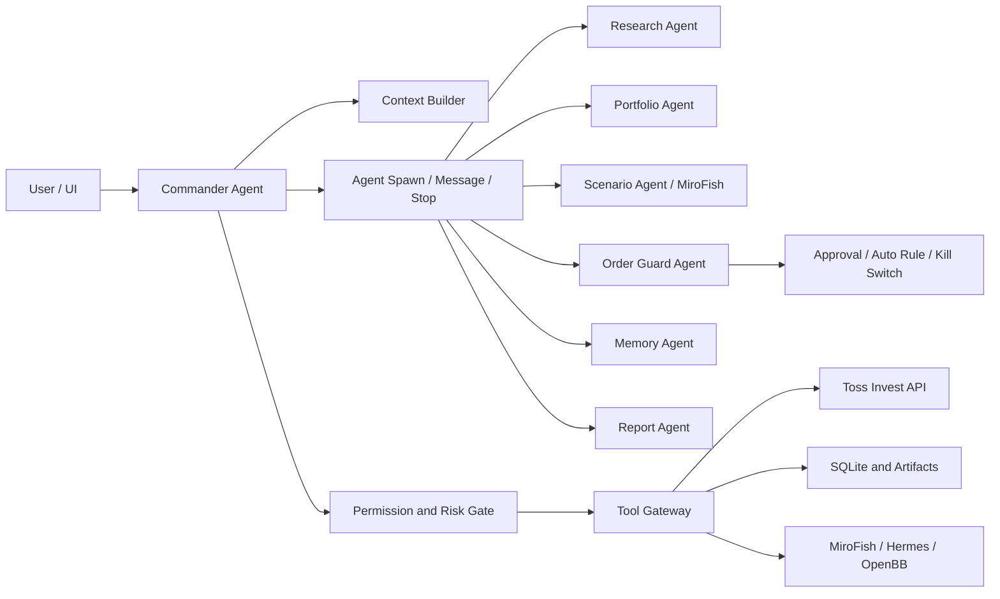
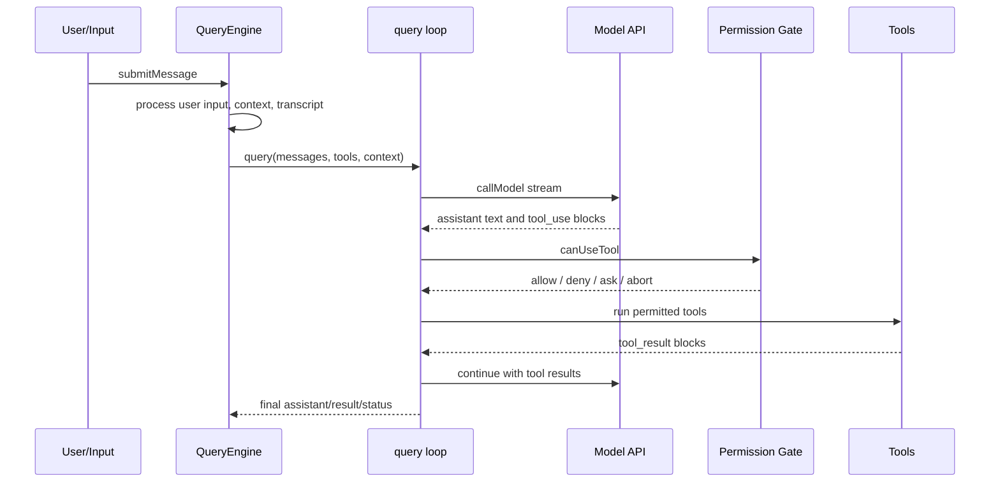
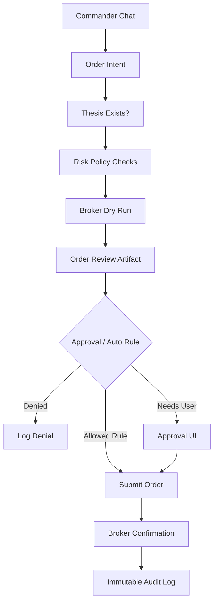
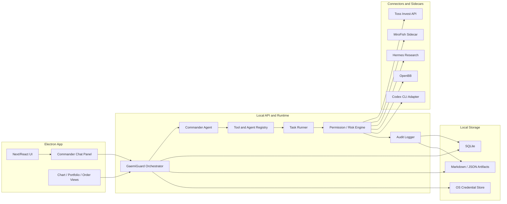

# Agent Runtime Patterns for GaemiGuard

Generated: 2026-06-04

This is a generalized design pattern document. It captures agent-runtime architecture lessons that are useful for GaemiGuard without depending on, copying, or identifying any third-party source tree.

## Executive Decision

Yes: GaemiGuard should have an internal top-level Commander Agent.

The Commander Agent should not be a thin router. It should be the main runtime brain behind the right-side chat panel. It owns intent understanding, context assembly, specialist delegation, task supervision, risk synthesis, and final user-facing answers. Specialist agents do research, portfolio analysis, scenario simulation, memory updates, order review, and report writing under the Commander's control.

For trading, the Commander may request order actions, but it must not bypass the Order Guard. The actual order path must go through deterministic policy checks, audit logging, kill switches, idempotency, and approval/auto-execution rules.

## Top-Level Finding

The reference pattern is built around one reusable agent loop:

1. Build session context and system prompt.
2. Send messages to an LLM.
3. Receive streamed assistant output.
4. Collect tool-use blocks.
5. Run tools under permission control.
6. Append tool results back into the conversation.
7. Repeat until no more tool use, max-turn, budget, abort, or compact boundary.

Subagents are not a totally different engine. They are mostly the same query loop run with a different system prompt, different tool pool, different permission context, separate transcript, and task state.

That is the key pattern to adapt into GaemiGuard.

## Shape Of A Comparable Runtime

Root package:

- TypeScript ESM project.
- Bun-based scripts.
- CLI binary name: `claude`.
- Main binary target: `src/entrypoints/cli.tsx`.
- Main stack: Commander, React/Ink terminal UI, Anthropic SDK, MCP SDK, OpenTelemetry, Zod, plugin/skill/custom agent systems.

Major areas:

- `src/entrypoints`: fast CLI bootstraps and special modes.
- `src/main.tsx`: main Commander CLI parser and session setup.
- `src/QueryEngine.ts`: conversation engine wrapper for SDK/headless/REPL flows.
- `src/query.ts`: core model-tool loop.
- `src/Tool.ts`: tool interface and tool contract.
- `src/tools.ts`: built-in tool registry and tool-pool assembly.
- `src/tools/*`: concrete tools.
- `src/tools/AgentTool`: subagent, background worker, fork, and custom agent handling.
- `src/coordinator`: top-level coordinator mode prompt and behavior.
- `src/tasks`: background task/task-panel model.
- `src/hooks/toolPermission` and `src/utils/permissions`: permission request, auto mode, allow/deny, classifier, and safety checks.
- `src/services/api`: Claude API request building, streaming/non-streaming, prompt cache, retries.
- `src/services/mcp`: MCP client/auth/config/tool wrapping.
- `src/skills`: local/project/user/plugin skill loading.
- `src/bridge`, `src/server`, `src/cli/transports`: remote control, direct-connect, web terminal, structured I/O.
- `web`: separate Next.js web UI prototype/client.
- `mcp-server`: helper MCP server for exploring this codebase.
- `docker`: containerized web terminal around the CLI.

## Core Runtime Path

Main CLI flow:

1. `src/entrypoints/cli.tsx` does fast-path dispatch before loading the full CLI.
2. `src/main.tsx` builds Commander commands/options, resolves settings, agents, tools, MCP servers, permission mode, session state, and UI/headless mode.
3. Interactive mode launches the REPL UI. Headless mode goes through `src/cli/print.ts`.
4. Both converge on `QueryEngine`/`query`.

Key evidence:

- `src/entrypoints/cli.tsx:35` starts the bootstrap entrypoint.
- `src/main.tsx:968` defines the main `claude` command and most CLI options.
- `src/QueryEngine.ts:184` defines the `QueryEngine` class.
- `src/QueryEngine.ts:209` starts `submitMessage`.
- `src/query.ts:241` starts the inner query loop.
- `src/services/api/claude.ts:709` handles non-streaming model calls.
- `src/services/api/claude.ts:3213` builds system prompt blocks.

The query loop is the essential reusable part:

## System Prompt and Context

The system prompt is built as composable sections, not one static string.

Key responsibilities:

- Static identity and tool-use rules.
- Session-specific guidance based on enabled tools.
- Memory prompt.
- Environment info.
- Language and output style.
- MCP server instructions.
- Scratchpad and tool-result summarization instructions.
- Prompt cache boundary between stable and dynamic sections.

Key evidence:

- `src/constants/prompts.ts:444` defines `getSystemPrompt`.
- `src/constants/prompts.ts:359` checks whether AgentTool is enabled.
- `src/constants/prompts.ts:316` builds AgentTool-specific guidance.
- `src/context.ts:116` builds system context.
- `src/context.ts:172` loads user memory/CLAUDE.md context.

GaemiGuard equivalent:

- `CommanderSystemPrompt` should be assembled from modules:
  - Product promise and role.
  - User's investment principles.
  - Account/portfolio snapshot.
  - Active chart/selection context.
  - Available tools and permission mode.
  - Current risk posture.
  - Memory and recent artifacts.
  - Compliance boundaries.

Do not keep one giant hard-coded prompt. Use section builders and cache/staleness metadata per section.

## Tool System

The tool contract is generic and centralized. Each tool declares schema, description, permission check behavior, render behavior, and execution behavior.

Key evidence:

- `src/Tool.ts` defines the generic tool contract.
- `src/tools.ts:179` defines the default preset.
- `src/tools.ts:193` builds the base tool list.
- `src/services/tools/toolOrchestration.ts` runs tool batches.
- `src/services/tools/StreamingToolExecutor.ts:40` handles streaming tool execution.
- `src/services/tools/toolExecution.ts` handles validation, permissions, hooks, and execution.

Important tool categories:

- Files: read, write, edit, glob, grep, notebook edit.
- Shell: Bash and PowerShell.
- Web: search and fetch.
- MCP: list/read resources, MCP auth, ToolSearch.
- Agents: AgentTool, SendMessage, TaskStop, team tools.
- Tasks: create, update, get, list, output.
- Planning/workflow: enter/exit plan mode, worktree, cron, remote trigger, brief.
- Skills/plugins: SkillTool and plugin-provided tools/commands.

GaemiGuard equivalent tool categories:

- Market data tools: quotes, candles, instrument lookup, exchange hours.
- Broker tools: Toss account, balance, positions, orders, dry-run, submit, cancel.
- Research tools: news, filings, OpenBB, Hermes, local PDFs/Markdown/CSV.
- Scenario tools: MiroFish run, scenario compare, assumption edit.
- Memory tools: thesis create/update, rule create/update, trade journal, artifact search.
- Risk tools: exposure check, cooldown check, sector concentration, volatility/liquidity check.
- UI tools: focus chart range, open artifact, ask user approval.

## Permission Model

The reference pattern has explicit permission modes, permission rules, and safety checks.

Key evidence:

- `src/utils/permissions/PermissionMode.ts:42` maps permission modes to titles and external names.
- `src/utils/permissions/permissionSetup.ts:295` finds dangerous classifier permissions.
- `src/hooks/toolPermission/PermissionContext.ts` builds the approval/denial flow.
- `src/tools/BashTool/bashPermissions.ts` hardens shell command permission checks.
- `src/tools/PowerShellTool/powershellPermissions.ts` does the Windows equivalent.

Observed permission modes:

- `default`: ask when required.
- `plan`: restrict action while planning.
- `acceptEdits`: allow edits under bounded conditions.
- `bypassPermissions`: skip permission prompts.
- `dontAsk`: non-interactive behavior.
- `auto`: classifier-backed auto mode when feature-gated.
- `bubble`: used for some subagent flows to bubble decisions upward.

Important detail: auto mode is not just "approve everything." It strips or blocks dangerous allow rules, especially broad Bash/PowerShell/Agent permissions that could bypass classifier evaluation.

GaemiGuard permission modes should be:

- `manual`: ask for all write/order/external side effects.
- `guarded_auto`: approve low-risk reads and deterministic safe tasks; route risky tool calls through classifier/policy checks.
- `trusted_auto`: allow scheduled/background workflows, but still enforce hard trading limits.
- `full_access`: local-only developer mode, never the default for live trading.
- `paper_auto`: automatic paper trading.
- `live_auto`: live trading only after explicit user enablement, kill switches, per-rule caps, and audit logging.

The Codex-style UI mapping can be:

- "Ask for approval" -> `manual`
- "Approve for me" -> `guarded_auto`
- "Full access" -> `trusted_auto` for non-trading tools, never unbounded live orders

For live orders, permission mode is not enough. Order submission must also pass deterministic order policy.

## Agent System

The subagent architecture is the most important part for GaemiGuard.

Key evidence:

- `src/tools/AgentTool/AgentTool.tsx:196` defines AgentTool.
- `src/tools/AgentTool/AgentTool.tsx:239` starts its call handler.
- `src/tools/AgentTool/AgentTool.tsx:567` decides whether to run async/background.
- `src/tools/AgentTool/AgentTool.tsx:575` sets worker permission context.
- `src/tools/AgentTool/runAgent.ts:415` resolves agent permission mode.
- `src/tools/AgentTool/runAgent.ts:502` resolves agent tools.
- `src/tools/AgentTool/runAgent.ts:700` creates subagent context.
- `src/tools/AgentTool/runAgent.ts:748` runs the query loop for the subagent.
- `src/tools/AgentTool/loadAgentsDir.ts:162` defines `AgentDefinition`.
- `src/tools/AgentTool/loadAgentsDir.ts:300` starts loading built-in/custom/plugin agents.
- `src/tools/AgentTool/agentToolUtils.ts:70` filters tools for agents.
- `src/tools/AgentTool/agentToolUtils.ts:122` resolves explicit tool specs.
- `src/tasks/LocalAgentTask/LocalAgentTask.tsx` tracks background agent progress and notifications.
- `src/tools/SendMessageTool/SendMessageTool.ts:520` defines inter-agent messaging.
- `src/tools/TeamCreateTool/TeamCreateTool.ts:74` defines team creation.

Agent definitions carry:

- agent type/name
- description / when-to-use
- prompt/system prompt
- tool allow/disallow specs
- model/effort
- permission mode
- MCP server requirements
- hooks
- memory settings
- background/isolation behavior

GaemiGuard should directly implement this pattern.

Recommended GaemiGuard agents:

- `CommanderAgent`: top-level conductor behind the right sidebar.
- `PortfolioAgent`: account, holdings, exposure, PnL, cash, FX, concentration.
- `ResearchAgent`: Hermes/OpenBB/news/filings/local docs synthesis.
- `ScenarioAgent`: MiroFish input packaging, simulation execution, result interpretation.
- `OrderGuardAgent`: order review, policy checks, approval artifact.
- `BrokerAgent`: Toss API adapter, read-only broker facts, dry-run/submit/cancel as gated tools.
- `MemoryAgent`: thesis, rule, journal, artifact, temporal memory updates.
- `ReportAgent`: daily/weekly review, trade rationale, scenario reports.
- `SettingsSecretsAgent`: API keys, connector status, provider health.
- `ExternalSignalAgent`: optional replacement for the current "Community Signal Agent"; keep disabled until source policy is settled.

## Coordinator Mode

The reference pattern has an explicit coordinator mode. This is the closest match to the user's "internal agent that commands the other agents" idea.

Key evidence:

- `src/coordinator/coordinatorMode.ts:36` checks coordinator mode.
- `src/coordinator/coordinatorMode.ts:111` builds the coordinator system prompt.
- `src/constants/tools.ts` defines the coordinator-allowed tool subset.

Coordinator behavior:

- Main agent supervises workers.
- It delegates research/implementation/verification.
- It receives task notifications as user-role messages.
- It uses a small allowed toolset, mostly Agent, SendMessage, TaskStop, and SyntheticOutput.
- It is responsible for synthesis and user communication.

GaemiGuard Commander should use the same split:

- Commander can spawn specialists.
- Commander can send follow-up messages.
- Commander can stop runaway work.
- Commander can synthesize.
- Commander should not directly own every dangerous business tool.

For GaemiGuard, the Commander's default toolset should be:

- `spawn_agent`
- `send_agent_message`
- `stop_agent`
- `read_context`
- `read_artifact`
- `create_task`
- `update_task`
- `ask_user`
- `draft_order_review`
- `run_risk_gate`

It should not directly call `submit_live_order` except through an explicit Order Guard path.

## Task and Background Work

The task system separates long-running work from foreground conversation.

Key evidence:

- `src/tasks/types.ts` unions all task types.
- `src/tasks/LocalAgentTask/LocalAgentTask.tsx` tracks local background agents.
- `src/tools/TaskCreateTool/TaskCreateTool.ts:48` defines task creation.
- `src/tools/TaskStopTool/TaskStopTool.ts:39` defines task stop.
- `src/tools/TaskOutputTool/TaskOutputTool.tsx:144` exposes task output.

GaemiGuard needs this immediately because investment workflows are long-running:

- morning research run
- weekly portfolio review
- scenario simulation
- order review
- backtest/paper trading
- live rule monitor

Each run should have:

- `run_id`
- status
- owner agent
- input snapshot
- tool calls
- artifacts
- decisions
- blocked actions
- cost/time
- final summary

## Memory and Persistence

The reference pattern uses several persistence layers:

- conversation transcripts as `.jsonl`
- subagent sidechain transcripts
- CLAUDE.md/project/user memory files
- file-based auto memory
- task output artifacts
- settings and plugin state

Key evidence:

- `src/utils/sessionStorage.ts:1408` records transcripts.
- `src/utils/sessionStorage.ts:257` builds agent transcript paths.
- `src/utils/conversationRecovery.ts:456` loads conversations for resume.
- `src/utils/claudemd.ts:790` discovers memory files.
- `src/memdir/memdir.ts:419` loads the memory prompt.

GaemiGuard persistence should be:

- SQLite for entities and indexes.
- Markdown/JSON artifacts for human-readable reports and run output.
- JSONL event logs for agent/tool/order audit.
- Optional Graphiti/temporal memory for relationship and time-aware recall.

Core entities:

- Account
- BrokerConnection
- Instrument
- PriceSnapshot
- Position
- PortfolioSnapshot
- Thesis
- Rule
- AgentRun
- ToolCall
- Artifact
- ScenarioRun
- OrderReview
- OrderIntent
- OrderRequest
- TradeJournal
- RiskEvent
- ApprovalDecision
- AutomationRule

## Web, Server, and Docker Parts

These parts are useful but secondary.

`web/`:

- A separate Next.js UI.
- Zustand store.
- Chat layout/components/settings/file viewer/export/collaboration surfaces.
- `web/app/api/chat/route.ts` proxies chat to a backend API.

`src/server/web`:

- Express + WebSocket + node-pty web terminal around the CLI.
- Session resume, scrollback buffer, auth adapters, admin view.

`docker/`:

- Container builds the CLI and runs the web terminal.
- Useful for deployment experiments.
- Not required for GaemiGuard's local app if we use Electron + local API + sidecars.

`mcp-server/`:

- MCP explorer server for reading/listing/searching source.
- Useful as a pattern for exposing GaemiGuard capabilities to other agents.
- Not part of the core agent runtime.

## Codex CLI Use in GaemiGuard

Use Codex CLI as a provider/tool, not as the whole orchestration runtime.

Recommended approach:

- Build GaemiGuard's own orchestrator API.
- Add provider adapters:
  - OpenAI Responses/Agents SDK adapter.
  - Anthropic adapter if needed.
  - Codex CLI adapter for local coding/operator-style tasks.
  - Local sidecar adapter for MiroFish/Hermes.
- Let the Commander choose a provider per task.

Codex CLI can be useful for:

- local code/file operations
- repo analysis
- generating or validating strategy scripts
- running local tools under approval modes
- acting as one specialist agent backend

Codex CLI should not be the only source of truth for:

- broker order state
- risk rules
- audit logs
- scheduled trading automation

No, the user should not need Docker every time. The local app target should be:

- Electron shell.
- Local API process.
- SQLite database.
- uv-managed Python sidecars.
- OS credential store.
- Optional CLI providers launched as child processes.

## Trading-Specific Architecture

The trading path must be stricter than generic file/tool execution.

Order submission should require all of these:

- current account snapshot
- current market/session status
- symbol/instrument validation
- thesis or rule reference
- exposure and cash checks
- cooldown/overtrading checks
- per-symbol and per-sector caps
- price/quantity/slippage guard
- MiroFish/Hermes risk signals considered, not blindly obeyed
- idempotency key
- approval record or matching auto-rule
- global and per-rule kill switch not active

## MiroFish Integration

MiroFish should be a Scenario Agent sidecar, not a direct trader.

Input bundle:

- selected instrument(s)
- chart range and candle data
- volume/liquidity data
- portfolio exposure
- current thesis/rules
- user question
- Hermes/OpenBB/research summary
- macro/FX/rates context
- known assumptions

Output artifact:

- scenario range, not a single prediction
- assumptions
- confidence/uncertainty
- risk factors
- timeline
- links to generated graph/report
- Order Guard interpretation

MiroFish output may influence an order review, but it should never bypass the Order Guard.

## GaemiGuard Build Stages

This is not an MVP plan. It is a staged build path.

Stage 1: Local Foundation

- Electron/Next shell.
- Local API process.
- SQLite schema.
- artifact folder.
- OS credential store wrapper.
- right-sidebar Commander chat placeholder.

Stage 2: Agent Runtime Core

- `CommanderAgent`.
- provider adapter interface.
- tool registry.
- permission modes.
- agent run/task table.
- JSONL audit log.
- first specialist: `ResearchAgent` or `PortfolioAgent`.

Stage 3: Toss Read-Only Connector

- Toss OpenAPI schema/codegen.
- account/positions/balances/orders read-only.
- market data and instrument lookup.
- connector health panel.

Stage 4: Context-Aware UI

- chart selection -> Commander context.
- portfolio snapshot -> Commander context.
- artifact viewer.
- run timeline in right panel.

Stage 5: MiroFish Scenario Sidecar

- uv-managed sidecar.
- per-run isolated working dir.
- input bundle contract.
- scenario artifact generation.
- Scenario Agent integration.

Stage 6: Order Guard Dry Run

- order intent model.
- deterministic risk checks.
- dry-run broker adapter.
- order review artifact.
- no live submit yet.

Stage 7: Human-Approved Live Orders

- submit after user approval.
- idempotency keys.
- audit log.
- cancel/update review.
- global kill switch.

Stage 8: Rule-Based Automation

- scheduled/background tasks.
- paper auto first.
- live auto only per explicit rule.
- per-rule kill switch and max loss/order caps.
- notification and post-trade journal.

Stage 9: Full Memory and Review Loop

- thesis versioning.
- trade journal automation.
- weekly review reports.
- Graphiti/temporal memory indexing.
- agent self-review and verifier runs.

## Design Spec Adjustments

Based on `gaemiguard-design-spec.md`, these should be changed or clarified:

- Do not use "MVP" as the product planning language. Use staged build.
- Keep "Community Signal Agent" disabled or rename it to `ExternalSignalAgent` until the data source policy is chosen.
- "Codex as local LLM provider" should become "Codex CLI provider adapter." The orchestrator remains GaemiGuard-owned.
- "Full automatic trading" should be split into paper auto, guarded live auto, and full developer mode. Do not let "full access" mean unrestricted broker access.
- The right sidebar should be the Commander chat panel, not only a passive assistant panel.
- Order authority should be modeled separately from general agent authority.
- MiroFish should be scenario evidence, not an order executor.
- Every agent run and order review must produce artifacts and audit events.

## Recommended Final Architecture

## Non-Negotiables

- Live order submit is never a generic tool call.
- Every order action has an immutable audit event.
- Every agent/tool run stores input snapshot and output artifact.
- Permission mode and order authority are separate.
- Background automation is kill-switchable globally and per rule.
- Sidecars run behind process boundaries.
- AGPL or uncertain-license tools stay out-of-process.
- Predictions are represented as scenarios with assumptions and uncertainty.
- UI must show what data the agent used.
- User can inspect why an action was blocked or approved.

## What to Build Next

Build the GaemiGuard Commander runtime skeleton first:

1. `agent_run` and `tool_call` SQLite tables.
2. `CommanderAgent` interface.
3. `ToolRegistry`.
4. `PermissionEngine`.
5. `spawnAgent`, `sendAgentMessage`, `stopAgent` internal tools.
6. Right sidebar chat wired to Commander.
7. Stub specialist agents returning artifacts.

After that, connect Toss read-only and MiroFish scenario runs.

This order avoids building a normal stock app first. It makes the actual product - an agentic investment terminal with guardrails - the spine from day one.
