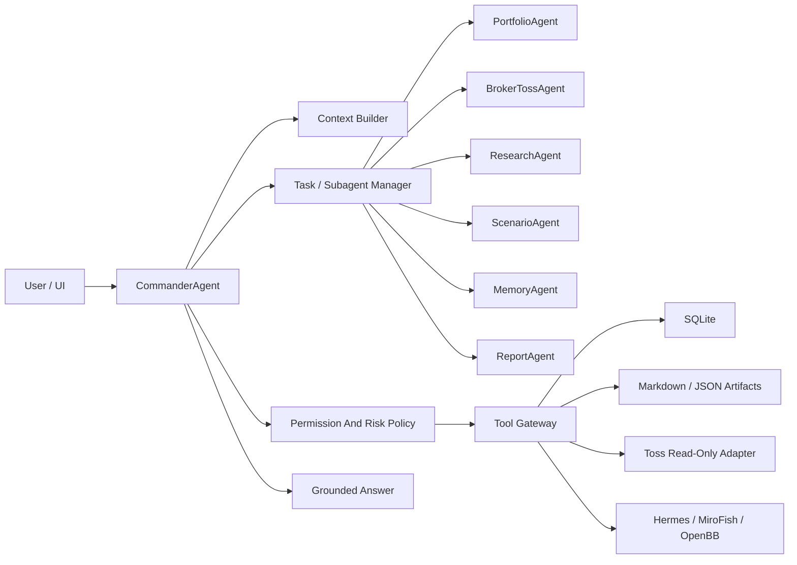

# Agent Runtime Patterns for GaemiGuard

Updated: 2026-06-06

This document captures reusable agent-runtime patterns for GaemiGuard.

It is not an implementation copy plan. External agent runtimes can inform the architecture only at the pattern level. Do not copy unclear, private, leaked, or license-incompatible implementation code into GaemiGuard.

For current product direction, read `docs/product/agent-first-direction.md` first.

## Runtime Decision

GaemiGuard should have one top-level `CommanderAgent`.

The Commander is the product-facing personal investment agent. It owns intent understanding, context assembly, specialist delegation, tool supervision, risk synthesis, artifact creation, and the final user-facing answer.

Specialists do bounded work under Commander supervision. They do not replace Commander as the user-facing product.

## Core Pattern

Most useful agent runtimes share one loop:

1. Build context and prompt sections.
2. Send messages to a model.
3. Receive assistant text and tool calls.
4. Authorize each tool call.
5. Execute allowed tools.
6. Append tool results.
7. Continue until the task ends, hits a budget, is stopped, or needs compaction.

Subagents are usually the same loop with a different prompt, tool set, permission rules, transcript, and task state.

## Primary Agents And Subagents

GaemiGuard should distinguish primary agents from subagents.

Primary agent:

- Receives the user's direct conversation.
- Owns the current session.
- Chooses whether to answer directly or delegate.
- Synthesizes the final response.

Subagent:

- Runs a bounded task.
- Has a narrower prompt.
- Has a narrower tool set.
- Has narrower permissions.
- Returns structured findings to Commander.

Useful built-in mode idea:

- Ask mode: read and explain.
- Plan mode: analyze and draft without side effects.
- Guarded Act mode: perform bounded local writes or approved safe tasks.

Trading authority is separate from all three modes. No mode can bypass Order Guard.

## Agent Definition Contract

Each GaemiGuard agent should be defined by a small structured contract:

| Field | Purpose |
| --- | --- |
| `name` | Stable agent identifier. |
| `mode` | `primary`, `subagent`, or `system`. |
| `description` | When Commander should use it. |
| `promptSections` | Product role, task rules, safety rules, and output format. |
| `tools` | Tool allowlist or denylist. |
| `permissions` | Read, write, external side effect, and trading authority rules. |
| `inputs` | Required context and redaction requirements. |
| `outputs` | Structured result shape returned to Commander. |
| `persistence` | SQLite rows, artifacts, event logs, or no persistence. |
| `tests` | Contract, redaction, permission, and failure tests. |

Do not add a new agent role without this contract.

## Tool Gateway

All model-requested actions should go through one tool gateway.

Tool definitions should include:

- Stable name.
- Input schema.
- Output schema.
- Read/write classification.
- Sensitive-data classification.
- Permission check.
- Execution function.
- Redaction behavior.
- Persistence behavior.
- Test coverage.

Important tool groups for GaemiGuard:

- Broker read tools: accounts, holdings, quotes, orderbook summaries, FX, calendars, warnings.
- Market tools: instrument lookup, price history, market hours, corporate events.
- Research tools: source fetch, news lookup, filings, local documents, Hermes/OpenBB outputs.
- Scenario tools: MiroFish run, assumption comparison, scenario artifact creation.
- Memory tools: thesis, rules, journal, artifact search, report recall.
- Risk tools: exposure, concentration, cooldown, liquidity, volatility, warning checks.
- UI tools: focus chart, open artifact, request approval, show freshness.

Broker order mutation tools must remain absent or hard-blocked until their approved stages.

## Permission Model

General agent permissions and trading authority are different systems.

General permission levels:

- `manual`: ask before writes, external side effects, and sensitive actions.
- `guarded_auto`: allow low-risk reads and deterministic safe tasks.
- `trusted_auto`: allow scheduled/background safe tasks after explicit setup.
- `full_access`: local developer mode for non-trading development work only.

Trading authority:

- Read-only broker data requires the Stage 2 credential and sync boundary.
- Order drafts and paper trading require later stage gates.
- Live order submit, modify, and cancel require Order Guard, audit log, kill switch, idempotency, user approval, stage evidence, and official API scope.
- Rule-based automation is a final-stage feature.

The Commander can request a trading action review. It cannot directly bypass the Order Guard path.

## Prompt And Context

Do not keep one giant Commander prompt.

Build the Commander context from sections:

- Product identity and boundaries.
- User question.
- Permission mode.
- Active UI selection.
- Account and portfolio freshness.
- Holdings and market snapshots.
- User thesis and rules.
- Relevant research artifacts.
- Scenario artifacts.
- Recent agent run timeline.
- Safety and compliance rules.
- Tool list and output schema.

Each section should carry freshness and redaction metadata when relevant.

## Task And Background Work

Investment workflows are often long-running:

- Morning guard.
- Daily or weekly report.
- Research run.
- Scenario run.
- Portfolio exposure review.
- Order draft review.
- Later rule monitor.

Represent these as tasks with:

- `run_id`
- parent run
- owner agent
- status
- input snapshot
- tool calls
- artifacts
- blocked actions
- cost/time metadata
- final summary

Commander should be able to start, stop, retry, and summarize tasks.

## Memory And Persistence

GaemiGuard should use:

- SQLite for structured entities and indexes.
- Markdown artifacts for human-readable explanations and reports.
- JSON artifacts for structured run output.
- Event logs for agent, tool, permission, and order-review audit.
- Optional temporal memory or graph tools only after the core memory contract is stable.

Core entities:

- Account reference
- Broker connection
- Instrument
- Price snapshot
- Holding snapshot
- Portfolio snapshot
- Thesis
- Rule
- Research artifact
- Scenario run
- Agent run
- Tool call
- Order review
- Approval decision
- Trade journal
- Risk event

Raw secrets, tokens, raw account numbers, order identifiers, and direct personal identifiers must not be persisted or sent to external agent context.

## Parallel Work

Parallel subagents are useful only when tasks do not share mutable state or unsafe side effects.

Good candidates:

- Read-only code or document exploration.
- Independent research source collection.
- Separate scenario drafts.
- Separate report sections.
- Verification and review after implementation.

Bad candidates:

- Multiple agents editing the same files.
- Multiple agents changing the same schema.
- Multiple agents touching credential or order paths.
- Any task where one result must be known before the next step.

For GaemiGuard development work, parallel sessions should use separate branches or worktrees and merge through a reviewed integration branch.

## UI Pattern

The UI should expose what the agent did:

- User question.
- Active mode.
- Data freshness.
- Delegated agents.
- Tool calls.
- Source artifacts.
- Blocked actions.
- Approval prompts.
- Final answer.

The terminal-like panels are evidence surfaces. They should help the user inspect why Commander answered a certain way.

## Implementation Order

Recommended order:

1. Keep Stage 2 focused on Toss read-only credential setup, real sync, freshness, and redaction.
2. Add source-grounded Commander answers only after snapshots have source/freshness links.
3. Add thesis, rules, journals, and research memory in Stage 3.
4. Add MiroFish scenario tasks in Stage 4.
5. Add order drafts and paper trading in Stage 5.
6. Add live orders only in Stage 6.
7. Add rule automation only in Stage 7.

Do not turn news, terminal panels, or automation into the product center before the personal investment agent is useful.

## Test Requirements

Each runtime slice should test:

- Agent contract shape.
- Tool input and output validation.
- Permission allow, ask, deny, and hard-block behavior.
- Redaction of secrets, tokens, raw account numbers, order IDs, and personal identifiers.
- SQLite and artifact persistence boundaries.
- API and Commander response safety.
- Freshness and source visibility.
- Failure states and blocked actions.

For order-related stages, tests must also cover:

- Order Guard policy.
- Idempotency.
- Kill switch.
- Approval capture.
- Audit log.
- No execution without accepted stage evidence.
