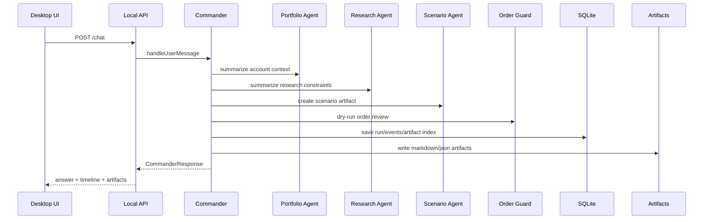

# Agent Runtime Architecture

Generated: 2026-06-04

## Runtime Rule

GaemiGuard owns the orchestration runtime. The personal investment agent is the product center. Codex CLI, Hermes, MiroFish, OpenBB, Toss, KIS, and future broker connectors are adapters/tools, not the system of record.

Terminal-style data panels are evidence surfaces for the agent. They should show source, freshness, and review state instead of becoming a standalone market terminal.

## Agents

- `CommanderAgent`: top-level conductor behind the right sidebar.
- `PortfolioAgent`: account, holdings, exposure, cash, FX, and allocation context.
- `ResearchAgent`: Hermes/OpenBB/news/local document synthesis.
- `ScenarioAgent`: MiroFish input packaging and scenario interpretation.
- `OrderGuardAgent`: order draft review, rule checks, approval surface, and hard blocks.
- `MemoryAgent`: thesis, rules, journal, artifact, and temporal memory updates.
- `ReportAgent`: daily/weekly review and trade rationale reports.
- `BrokerAgent`: broker-independent capability, credential, sync, freshness, and trading authority coordination.
- `BrokerTossAgent`: current Toss read-only adapter slice and future gated Toss operations.
- `BrokerKisAgent`: future KIS adapter after source notes, capability mapping, and fixtures.
- `SettingsSecretsAgent`: connector health, provider health, and credential setup.

## Stage 1 Runtime

Stage 1 uses deterministic stubs for specialists. This is intentional: the persistence, artifact, permission, and UI contracts need to be stable before attaching external tools.

## Permission Model

General agent permissions and order authority are separate.

General modes:

- `manual`: ask for external writes and process side effects.
- `guarded_auto`: allow low-risk reads and deterministic safe tasks.
- `trusted_auto`: allow background safe tasks.
- `full_access`: local developer mode for non-trading tools.

Trading rule:

- `submit_live_order` is blocked in Stage 1 for every permission mode.
- `submit_live_order` is also blocked in the Stage 2 Broker Connection Foundation slice for every permission mode.
- Future live submission must pass broker capability checks, Order Guard, audit log, kill switch, user approval or explicit automation rule, and idempotency.

## Stage 2 Broker Connection Runtime

Stage 2 is interpreted as Broker Connection Foundation. The completed implementation introduces the shared broker adapter contract, wraps the official Toss Invest OpenAPI read-only connector as the first adapter, adds a no-broker/manual portfolio foundation, and completes production-safe credential setup plus real read-only sync.

- `BrokerAgent` is the broker-independent runtime role.
- `BrokerAgent` receives common adapter availability, freshness, authority, and capability metadata before any broker-specific specialist metadata.
- `BrokerTossAgent` can advertise only read-only tool names: account list, holdings, current prices, orderbook summary, exchange rate, market calendar, and stock warnings.
- `BrokerTossAgent` remains the Toss adapter specialist. It must not answer holdings, balances, buying power, or account facts unless a source/freshness-grounded snapshot is available.
- The API health check reports both the common `broker_adapters` status and the Toss-specific connector mode, freshness, failure/retry metadata, and official OpenAPI version.
- Default local runtime mode is `not_configured`; tests may inject a `mock_replay` connector or fake credential store.
- Manual no-broker runtime mode is available through the synthetic `manual:default` account reference and local watchlist, holding, and cash inputs.
- Client secrets and access tokens are kept at the OS credential/token boundary and are not written to SQLite, artifacts, Commander responses, or external agent context.
- Production sync uses raw Toss account sequence values only in memory for account-scoped read calls.
- Order creation, modification, and cancellation operation IDs are blocked before any HTTP call can be made.
- KIS is a future adapter candidate, not implemented in the current code.

## Stage 2 Persistence/Sync Runtime

Stage 2 snapshot persistence supports both mock replay and production read-only sync.

- `syncMockTossReadonlySnapshots` calls only the Stage 2 read-only connector operations and writes snapshot data to SQLite.
- `runTossReadonlySyncJob` runs production read-only sync through the credential boundary and writes sanitized snapshots.
- Stored account data is limited to masked account references. Raw account numbers, account sequence values, client secrets, access tokens, and order identifiers are not stored or forwarded.
- SQLite owns current snapshot tables for accounts, holdings, quotes, orderbook summaries, FX, market calendars, stock warnings, sync logs, rate-limit metadata, failure category, retry-after seconds, and next retry time.
- API `/health` reports `snapshotFreshness` and distinguishes `not_configured`, `credential_configured`, `syncing`, `readonly_available`, `stale`, `failed`, and `mock_replay`.
- `BrokerTossAgent` can include snapshot availability/freshness in timeline metadata. It answers holdings/account facts only when `production_snapshot` source and freshness metadata exist.
- No-broker/manual portfolio mode is represented in the DB/API/service contracts. Manual mode remains local context, not a broker connection.

## Stage 3 Research And Memory Runtime

Stage 3 adds local investment memory, source-backed local research artifacts, explicit user imports, and weekly review report artifacts before external research connectors.

- `MemoryAgent` can load thesis, rule, and journal context for Commander when the user asks memory-oriented questions.
- `MemoryAgent` can also recall source-backed research artifacts tied to symbols, holdings, watchlist items, and the originating user question.
- Memory records carry source metadata, freshness metadata, and optional broker snapshot references.
- Commander uses only memory records whose source/freshness status is usable. Stale broker-snapshot or research artifact memory is skipped and surfaced as skipped metadata, not treated as current evidence.
- SQLite stores thesis/rule version records and journal entries under the local memory contract.
- SQLite also stores local research artifacts under the same memory contract with research links metadata.
- API endpoints expose local memory writes and recall at `/memory/theses`, `/memory/rules`, `/memory/journal`, `/memory/research`, and `/memory/recall`.
- API endpoint `/memory/import/local` stores explicit user Markdown, CSV, or already-extracted PDF text imports as research memory with safe file names and source/freshness metadata.
- API endpoint `/reports/weekly-review` generates persisted `weekly_review_markdown` and `weekly_review_json` artifacts through `ReportAgent`.
- Desktop reads `/memory/recall` for the selected holding and shows source, freshness, links, and skipped stale/missing-source memory in a review panel.
- Desktop can author thesis/rule/journal/research memory, import local Markdown/CSV text, and generate weekly review artifacts for the selected symbol.
- Commander review cards surface MemoryAgent used/skipped grounding metadata when a run includes memory context.
- Secret, token, raw account, and order identifier sentinels are redacted before memory persistence and are covered by DB/API/Commander tests.
- Original local file paths are not retained for imports; imported source labels use safe file names only.
