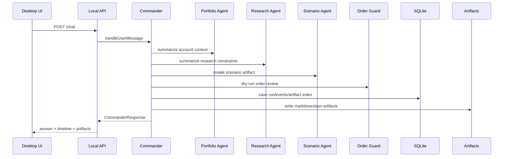

# Agent Runtime Architecture

Generated: 2026-06-04

## Runtime Rule

GaemiGuard owns the orchestration runtime. Codex CLI, Hermes, MiroFish, OpenBB, and Toss are adapters/tools, not the system of record.

## Agents

- `CommanderAgent`: top-level conductor behind the right sidebar.
- `PortfolioAgent`: account, holdings, exposure, cash, FX, and allocation context.
- `ResearchAgent`: Hermes/OpenBB/news/local document synthesis.
- `ScenarioAgent`: MiroFish input packaging and scenario interpretation.
- `OrderGuardAgent`: order draft review, rule checks, approval surface, and hard blocks.
- `MemoryAgent`: thesis, rules, journal, artifact, and temporal memory updates.
- `ReportAgent`: daily/weekly review and trade rationale reports.
- `BrokerTossAgent`: Toss read-only facts and future gated order operations.
- `SettingsSecretsAgent`: connector health, provider health, and credential setup.

## Stage 1 Runtime

Stage 1 uses deterministic stubs for specialists. This is intentional: the persistence, artifact, permission, and UI contracts need to be stable before attaching external tools.

## Permission Model

General agent permissions and order authority are separate.

General modes:

- `manual`: ask for external writes and process side effects.
- `guarded_auto`: allow low-risk reads and deterministic safe tasks.
- `trusted_auto`: allow background safe tasks.
- `full_access`: local developer mode for non-trading tools.

Trading rule:

- `submit_live_order` is blocked in Stage 1 for every permission mode.
- `submit_live_order` is also blocked in the Stage 2 Toss read-only connector slice for every permission mode.
- Future live submission must pass Order Guard, audit log, kill switch, user approval or explicit automation rule, and idempotency.

## Stage 2 First Slice Runtime

The first Stage 2 slice introduces the official Toss Invest OpenAPI read-only connector contract without enabling a production credential store.

- `BrokerTossAgent` can advertise only read-only tool names: account list, holdings, current prices, orderbook summary, exchange rate, market calendar, and stock warnings.
- The API health check reports the connector mode and official OpenAPI version.
- Default local runtime mode is `not_configured`; tests may inject a `mock_replay` connector.
- Client secrets and access tokens are kept at the injected credential/token boundary and are not written to SQLite, artifacts, Commander responses, or external agent context.
- Order creation, modification, and cancellation operation IDs are blocked before any HTTP call can be made.
