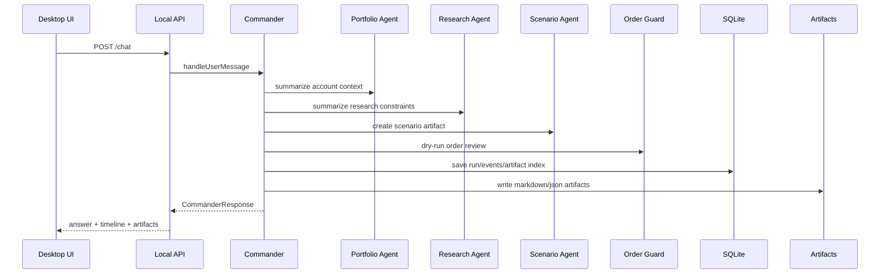

# Agent Runtime Architecture

Generated: 2026-06-04

## Runtime Rule

GaemiGuard owns the orchestration runtime. The personal investment agent is the product center. Codex CLI, Hermes, MiroFish, OpenBB, Toss, KIS, and future broker connectors are adapters/tools, not the system of record.

Terminal-style data panels are evidence surfaces for the agent. They should show source, freshness, and review state instead of becoming a standalone market terminal.

## Agents

- `CommanderAgent`: top-level conductor behind the right sidebar.
- `PortfolioAgent`: account, holdings, exposure, cash, FX, and allocation context.
- `ResearchAgent`: Hermes/OpenBB/news/local document synthesis.
- `ScenarioAgent`: MiroFish input packaging and scenario interpretation.
- `OrderGuardAgent`: order draft review, rule checks, approval surface, and hard blocks.
- `MemoryAgent`: thesis, rules, journal, artifact, and temporal memory updates.
- `ReportAgent`: daily/weekly review and trade rationale reports.
- `BrokerAgent`: broker-independent capability, credential, sync, freshness, and trading authority coordination.
- `BrokerTossAgent`: current Toss read-only adapter slice and future gated Toss operations.
- `BrokerKisAgent`: future KIS adapter after source notes, capability mapping, and fixtures.
- `SettingsSecretsAgent`: connector health, provider health, and credential setup.

## Stage 1 Runtime

Stage 1 uses deterministic stubs for specialists. This is intentional: the persistence, artifact, permission, and UI contracts need to be stable before attaching external tools.

## Permission Model

General agent permissions and order authority are separate.

General modes:

- `manual`: ask for external writes and process side effects.
- `guarded_auto`: allow low-risk reads and deterministic safe tasks.
- `trusted_auto`: allow background safe tasks.
- `full_access`: local developer mode for non-trading tools.

Trading rule:

- `submit_live_order` is blocked in Stage 1 for every permission mode.
- `submit_live_order` is also blocked in the Stage 2 Broker Connection Foundation slice for every permission mode.
- Future live submission must pass broker capability checks, Order Guard, audit log, kill switch, user approval or explicit automation rule, and idempotency.

## Stage 2 Broker Connection Runtime

Stage 2 is now interpreted as Broker Connection Foundation. The current implementation introduces the shared broker adapter contract, wraps the official Toss Invest OpenAPI read-only connector as the first adapter, and adds a no-broker/manual portfolio foundation without enabling a production credential store.

- `BrokerAgent` is the broker-independent runtime role.
- `BrokerAgent` receives common adapter availability, freshness, authority, and capability metadata before any broker-specific specialist metadata.
- `BrokerTossAgent` can advertise only read-only tool names: account list, holdings, current prices, orderbook summary, exchange rate, market calendar, and stock warnings.
- `BrokerTossAgent` remains the Toss adapter specialist. It must not answer holdings, balances, buying power, or account facts unless a source/freshness-grounded snapshot is available.
- The API health check reports both the common `broker_adapters` status and the Toss-specific connector mode plus official OpenAPI version.
- Default local runtime mode is `not_configured`; tests may inject a `mock_replay` connector.
- Manual no-broker runtime mode is available through the synthetic `manual:default` account reference and local watchlist, holding, and cash inputs.
- Client secrets and access tokens are kept at the injected credential/token boundary and are not written to SQLite, artifacts, Commander responses, or external agent context.
- Order creation, modification, and cancellation operation IDs are blocked before any HTTP call can be made.
- KIS is a future adapter candidate, not implemented in the current code.

## Stage 2 Persistence/Sync Slice Runtime

The second Stage 2 slice adds mock replay snapshot persistence without enabling production credentials or real Toss sync.

- `syncMockTossReadonlySnapshots` calls only the Stage 2 read-only connector operations and writes snapshot data to SQLite.
- Stored account data is limited to masked account references. Raw account numbers, client secrets, access tokens, and order identifiers are not stored or forwarded.
- SQLite owns current snapshot tables for accounts, holdings, quotes, orderbook summaries, FX, market calendars, stock warnings, sync logs, and rate-limit metadata.
- API `/health` can report `snapshotFreshness` for explicit mock replay syncs. It distinguishes `not_configured` from `mock_replay` and must not describe mock replay as a real Toss connection.
- `BrokerTossAgent` can include snapshot availability/freshness in timeline metadata. It still must not answer with holdings, balances, or account facts as grounded facts until the real sync and source-link slice is complete.
- No-broker/manual portfolio mode is represented in the DB/API/service contracts, but the desktop workflow has not been expanded into a full manual portfolio UI.
