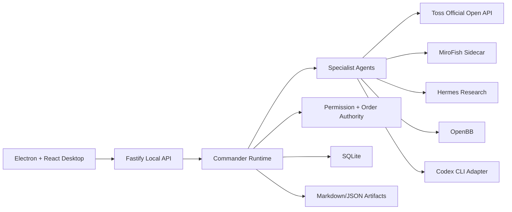

# System Architecture

Generated: 2026-06-04

## Architecture Decision

GaemiGuard owns the orchestration runtime. External systems are adapters.

## Process Model

| Process | Responsibility |
| --- | --- |
| Desktop app | UI, chart selection, Commander panel, settings surface |
| Local API | HTTP boundary, health, agent run endpoints, connector endpoints |
| Core runtime | Commander, specialists, policies, artifact writing |
| SQLite | Durable local system of record |
| Sidecars | MiroFish/Hermes/OpenBB process-bound tools |
| Provider adapters | Codex CLI and other LLM/tool providers |

## Boundary Rules

- UI never talks directly to Toss, MiroFish, Hermes, OpenBB, or Codex.
- Commander never submits live orders directly.
- Specialist agents never bypass the policy gateway.
- Sidecars receive sanitized context and artifact paths, not raw credentials.
- Toss credentials stay inside the Toss connector and OS credential boundary.
- Artifacts contain enough source snapshot to reproduce reasoning, but not raw secrets.

## Required Health Checks

Every runtime boot should report:

- API status.
- SQLite read/write.
- Artifact directory write.
- Toss auth readiness and API version.
- MiroFish sidecar version/health.
- Hermes/OpenBB availability if enabled.
- Codex CLI availability if enabled.
- Permission mode.
- Kill switch status.
- Last successful audit-log write.

## Failure Modes

| Failure | User-visible behavior | System behavior |
| --- | --- | --- |
| Toss token missing | Show connector setup needed | Do not call account APIs |
| Toss 429 | Show rate-limit status | Backoff and preserve retry metadata |
| Sidecar unavailable | Show scenario disabled | Keep account/research paths usable |
| Artifact write failure | Block sensitive run completion | Do not allow order review approval |
| DB write failure | Degrade to read-only UI | Block order paths |
| Kill switch on | Show global order block | Block all live order operations |
| LLM unavailable | Show provider degraded | Keep deterministic checks usable |

## Architecture Gate

No stage exits until:

- Module boundaries are reflected in code and docs.
- Health checks cover the new external dependency.
- Failure modes are represented in tests or manual gate evidence.
- Sensitive operations have deterministic policy checks.
