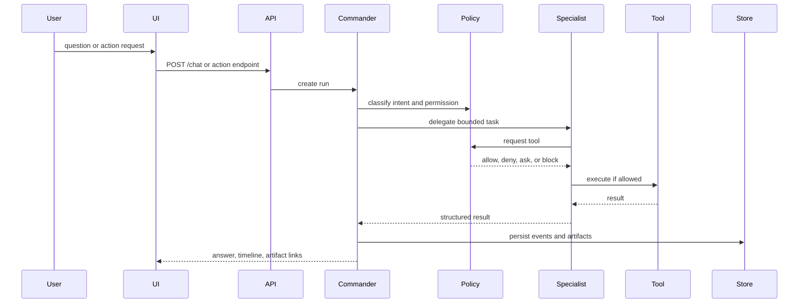

# Agent Orchestration

Generated: 2026-06-04

## Decision

GaemiGuard uses an internal `CommanderAgent`.

The Commander is the runtime owner behind the right sidebar. It is not a thin router. It receives user intent, assembles context, delegates to specialists, supervises tool execution, synthesizes the answer, and records the run.

## Agent Roles

| Agent | Responsibility | Stage introduced |
| --- | --- | --- |
| CommanderAgent | Top-level orchestration, context assembly, delegation, final synthesis | 1 |
| PortfolioAgent | Accounts, holdings, exposure, cash, FX, allocation | 1 stub, 2 real |
| BrokerTossAgent | Official Toss API connector and broker facts | 2 |
| ResearchAgent | Hermes/OpenBB/news/local document synthesis | 1 stub, 3 real |
| MemoryAgent | Thesis, rules, journals, temporal memory, recall | 3 |
| ScenarioAgent | MiroFish input packaging and scenario interpretation | 1 stub, 4 real |
| OrderGuardAgent | Order draft review, guard checks, approvals, hard blocks | 1 dry-run, 5+ real |
| ReportAgent | Daily/weekly review and trade-rationale reports | 3 |
| SettingsSecretsAgent | Connector health, provider health, credential setup | 2 |
| ExternalSignalAgent | Optional external signal ingestion, disabled by default | 7 or later |

## Agent Loop

## Routing Principles

- Commander owns the user conversation.
- Specialists receive task-specific context and cannot change global policy.
- Specialists return structured outputs, not free-form hidden authority.
- Every tool call is logged with input class, redaction status, result status, cost/time, and source artifact IDs.
- Commander can stop, retry, or reassign a specialist run.

## Tool Categories

| Category | Examples | Permission tier |
| --- | --- | --- |
| Read-only market/account | quotes, holdings, calendars | Read-safe |
| Local memory | thesis read, journal search | Workspace-scoped |
| Local writes | thesis update, rule update, artifact write | Approval depending on mode |
| Sidecar run | MiroFish, Hermes, OpenBB | Tool approval and sandbox |
| Provider run | Codex CLI, LLM provider | Provider approval and masking |
| Order draft | dry-run review, buying-power check | Order review authority |
| Live order | submit, modify, cancel | Trading authority only |

## Orchestration Gate

No stage exits until:

- New specialists have a structured contract.
- Tools are registered through policy gateway.
- Run timeline shows delegated agent, tool call, source, and result.
- Sensitive action interruptions can be approved or rejected.
